```mermaid
graph TD
    A[benzlokzik]
    B[C++]
    C1[C++ Libraries]
    C2[GTests]
    C3[SFML]
    C4[stb_image]
    C5[libarchive]
    D[Python Poetry]
    E1[Python Libraries]
    E2[Python Frameworks]
    E3[Python Unittests]
    F[Rust]
    G[Docker]
    H[FastAPI]
    I[Backend]
    J[DevOps]
    K[GitHub Actions]
    L[Pipelines]
    M[Database]
    N[SQL]
    O[NoSQL]
    P[PostgreSQL]
    Q[SurrealDB]
    R[Operating Systems]
    S[Manjaro]
    T[Ubuntu]
    U[Debian]
    V[Windows]
    W[CI/CD]
    X[WASM]
    Y[REST API]
    Z[GitHub]
    AA[Git]
    
    A --> B
    A --> D
    A --> F
    A --> G
    A --> H
    A --> I
    A --> J
    A --> M
    A --> R
    A --> W
    A --> X
    A --> Y
    A --> Z
    A --> AA
    
    B --> C1
    C1 --> C2
    C1 --> C3
    C1 --> C4
    C1 --> C5
    
    D --> E1
    D --> E2
    D --> E3
    
    I -->|APIs| H
    I -->|APIs| Y
    
    J --> K
    J --> L
    J --> W
    
    M --> N
    M --> O
    M --> P
    M --> Q
    
    R --> S
    R --> T
    R --> U
    R --> V
    
    style A fill:#f9a825,stroke:#333,stroke-width:2px;
    style B,C1,C2,C3,C4,C5,D,E1,E2,E3,F,G,H,I,J,K,L,M,N,O,P,Q,R,S,T,U,V,W,X,Y,Z,AA fill:#e0e0e0,stroke:#333,stroke-width:1px;
```

<picture>
 <source media="(prefers-color-scheme: dark)" srcset="https://raw.githubusercontent.com/benzlokzik/benzlokzik/main/img/grid-snakes/github-contribution-grid-snake-dark.svg" />
 <source media="(prefers-color-scheme: light)" srcset="https://raw.githubusercontent.com/benzlokzik/benzlokzik/main/img/grid-snakes/github-contribution-grid-snake.svg" />
 
</picture>
   

### Hi there 👋

###### **Wow, you're visitor number**

<!--
**benzlokzik/benzlokzik** is a ✨ _special_ ✨ repository because its `README.md` (this file) appears on your GitHub profile.

Here are some ideas to get you started:

- 👯 I’m looking to collaborate on ...
- 🤔 I’m looking for help with ...
- 💬 Ask me about ...
- 📫 How to reach me: ...
- 😄 Pronouns: ...
- ⚡ Fun fact: ...
-->

**About me**

- 🌱 I’m currently learning [Python](https://github.com/topics/python), [C++](https://github.com/topics/cpp) and
  interested in [Rust](https://github.com/topics/rust)
- 💜 I'm trying to romanticize programming
- 💬 Ask me about anything [here](https://github.com/benzlokzik/benzlokzik/issues)

---

:eyes: Show badges

[//]: # (  )

[//]: # ( )

   

| <picture> <source srcset="https://raw.githubusercontent.com/benzlokzik/benzlokzik/main/img/github-stats/monokai/github-readme-stats-monokai.svg" media="(prefers-color-scheme: dark)"/><source srcset="https://raw.githubusercontent.com/benzlokzik/benzlokzik/main/img/github-stats/buefy/github-readme-stats-buefy.svg" media="(prefers-color-scheme: light), (prefers-color-scheme: no-preference)"/>  </picture> |              <picture><source srcset="https://raw.githubusercontent.com/benzlokzik/benzlokzik/main/img/top-langs/monokai/github-top-langs-monokai.svg" media="(prefers-color-scheme: dark)"/><source srcset="https://raw.githubusercontent.com/benzlokzik/benzlokzik/main/img/top-langs/buefy/github-top-langs-buefy.svg" media="(prefers-color-scheme: light), (prefers-color-scheme: no-preference)"/></picture>               |
|:---------------------------------------------------------------------------------------------------------------------------------------------------------------------------------------------------------------------------------------------------------------------------------------------------------------------------------------------------------------------------------------------------------------------------------------------------------------------------------------------------------------------------------------------------:|:---------------------------------------------------------------------------------------------------------------------------------------------------------------------------------------------------------------------------------------------------------------------------------------------------------------------------------------------------------------------------------------------------------------------------------------------------------------------------------------------------------------------------------------------------------:|
| <picture> <source srcset="https://raw.githubusercontent.com/benzlokzik/benzlokzik/main/img/streak-stats/monokai/streak-stats-monokai-weekly.svg" media="(prefers-color-scheme: dark)"/><source srcset="https://raw.githubusercontent.com/benzlokzik/benzlokzik/main/img/streak-stats/buefy/streak-stats-buefy-weekly.svg" media="(prefers-color-scheme: light), (prefers-color-scheme: no-preference)"/>  </picture> | <picture><source srcset="https://raw.githubusercontent.com/benzlokzik/benzlokzik/main/img/streak-stats/monokai/streak-stats-monokai-ru-weekly.svg" media="(prefers-color-scheme: dark)"/><source srcset="https://raw.githubusercontent.com/benzlokzik/benzlokzik/main/img/streak-stats/buefy/streak-stats-buefy-ru-weekly.svg" media="(prefers-color-scheme: light), (prefers-color-scheme: no-preference)"/></picture> |
|           <picture> <source srcset="https://raw.githubusercontent.com/benzlokzik/benzlokzik/main/img/streak-stats/monokai/streak-stats-monokai.svg" media="(prefers-color-scheme: dark)"/><source srcset="https://raw.githubusercontent.com/benzlokzik/benzlokzik/main/img/streak-stats/buefy/streak-stats-buefy.svg" media="(prefers-color-scheme: light), (prefers-color-scheme: no-preference)"/>  </picture>            |            <picture><source srcset="https://raw.githubusercontent.com/benzlokzik/benzlokzik/main/img/streak-stats/monokai/streak-stats-monokai-hy.svg" media="(prefers-color-scheme: dark)"/><source srcset="https://raw.githubusercontent.com/benzlokzik/benzlokzik/main/img/streak-stats/buefy/streak-stats-buefy-hy.svg" media="(prefers-color-scheme: light), (prefers-color-scheme: no-preference)"/></picture>            |

   

 

:zap: My interests
   

