```mermaid
graph TD
    A[benzlokzik ⚡]

    %% Core pillars (Wow focus)
    A --> ML["ML / AI"]
    A --> PY["Python (Senior)"]
    A --> VOICE[Voice Tech]
    A --> BE["Backend (Senior Stack)"]
    A --> DEVOPS["Deploy / DevOps"]
    A --> GLSL["Self-written Shaders (GLSL)"]
    A --> GO["Go (forced 😄)"]
    A --> WEB["Web / Frontend"]
    A --> SEC["Security / CTFs"]
    A --> VCS["VCS / Platforms"]
    A --> OS[Operating Systems]

    %% ML / AI
    ML --> PT[PyTorch]
    ML --> TR[Transformers]
    ML --> ONNX[ONNX]
    ML --> TRT[Triton Inference Server]
    ML --> MLOPS[MLOps]
    ML --> HROPS[HROps]
    ML --> F5[F5-TTS]

    %% Python ecosystem
    PY --> UV[uv]
    PY --> RUFF[ruff]
    PY --> PYFW[Frameworks]
    PY --> PYTOOLS[Tooling]

    PYFW --> FAST[FastAPI]
    PYFW --> DJ[Django]

    PYTOOLS --> TESTS[Testing]
    TESTS --> UT[Unittests]
    PYTOOLS --> DATA["numpy / pandas / sklearn"]
    PYTOOLS --> VIZ[matplotlib]

    %% Voice Tech (ties into ML)
    VOICE --> ASR["TTS / Speech Pipelines"]
    ASR --> F5
    VOICE --> INFER["Realtime/Low-latency Inference"]
    INFER --> TRT
    INFER --> ONNX

    %% Backend + Deploy
    BE --> API["REST / gRPC"]
    BE --> DB[Databases]
    DB --> PG[PostgreSQL]
    DB --> SQL[SQL]
    BE --> SRV["Web Servers / Edge"]
    SRV --> CADDY[Caddy]

    DEVOPS --> DOCKER[Docker]
    DEVOPS --> K8S[Kubernetes]
    DEVOPS --> CICD["CI/CD"]
    CICD --> GL[GitLab CI]
    CICD --> GHA[GitHub Actions]
    DEVOPS --> OBS[Observability]
    DEVOPS --> SECOPS[Secure Deploy]

    %% Web / Frontend
    WEB --> SV[Svelte]
    WEB --> SVK[SvelteKit]
    WEB --> JS[JavaScript]
    WEB --> TS[TypeScript]

    %% VCS / Platforms (priority)
    VCS --> GLAB["GitLab ⭐ (primary)"]
    VCS --> GH[GitHub]

    %% OS (macOS high)
    OS --> MAC["macOS (current)"]
    OS --> LNX[Linux]
    OS --> WIN[Windows]
    LNX --> ARCH[Arch-based]
    LNX --> DEB["Debian/Ubuntu"]

    %% Existing interests kept (minus removals)
    A --> CPP["C++"]
    CPP --> CPPLIBS["C++ Libraries"]
    CPPLIBS --> GTEST[GTests]
    CPPLIBS --> SFML[SFML]
    CPPLIBS --> STB[stb_image]

    %% Styling (Wow)
    style A fill:#f9a825,stroke:#111,stroke-width:3px,color:#111;

    style ML fill:#ff6f61,stroke:#111,stroke-width:2px;
    style PY fill:#6c63ff,stroke:#111,stroke-width:2px;
    style VOICE fill:#00bcd4,stroke:#111,stroke-width:2px;
    style GLSL fill:#ff9800,stroke:#111,stroke-width:2px;
    style BE fill:#4caf50,stroke:#111,stroke-width:2px;
    style DEVOPS fill:#607d8b,stroke:#111,stroke-width:2px;
    style GO fill:#00acc1,stroke:#111,stroke-width:2px;
    style WEB fill:#e91e63,stroke:#111,stroke-width:2px;
    style SEC fill:#9c27b0,stroke:#111,stroke-width:2px;
    style VCS fill:#f06292,stroke:#111,stroke-width:2px;
    style OS fill:#8d6e63,stroke:#111,stroke-width:2px;

    %% Emphasis nodes
    style GLAB fill:#fc6d26,stroke:#111,stroke-width:3px,color:#111;
    style PT fill:#ee4c2c,stroke:#111,stroke-width:3px,color:#111;
    style TR fill:#ffcc80,stroke:#111,stroke-width:3px,color:#111;
    style UV fill:#b3e5fc,stroke:#111,stroke-width:3px,color:#111;
    style RUFF fill:#c8e6c9,stroke:#111,stroke-width:3px,color:#111;
    style MAC fill:#d1c4e9,stroke:#111,stroke-width:3px,color:#111;
```

<picture>
 <source media="(prefers-color-scheme: dark)" srcset="https://raw.githubusercontent.com/benzlokzik/benzlokzik/main/img/grid-snakes/github-contribution-grid-snake-dark.svg" />
 <source media="(prefers-color-scheme: light)" srcset="https://raw.githubusercontent.com/benzlokzik/benzlokzik/main/img/grid-snakes/github-contribution-grid-snake.svg" />
 
</picture>
   

### Hi there 👋

###### **Wow, you're visitor number**

<!--
**benzlokzik/benzlokzik** is a ✨ _special_ ✨ repository because its `README.md` (this file) appears on your GitHub profile.

Here are some ideas to get you started:

- 👯 I’m looking to collaborate on ...
- 🤔 I’m looking for help with ...
- 💬 Ask me about ...
- 📫 How to reach me: ...
- 😄 Pronouns: ...
- ⚡ Fun fact: ...
-->

**About me**

- 🌱 I’m currently learning [Python](https://github.com/topics/python), [C++](https://github.com/topics/cpp) and
  interested in [Rust](https://github.com/topics/rust)
- 💜 I'm trying to romanticize programming
- 💬 Ask me about anything [here](https://github.com/benzlokzik/benzlokzik/issues)

---

:eyes: Show badges

[//]: # (  )

[//]: # ( )

   

| <picture><source srcset="https://github-readme-stats-w0ht-4yrydr66s-benzlokziks-projects.vercel.app/api?username=benzlokzik&show_icons=true&include_all_commits=true&show=reviews%2Cdiscussions_started%2Cdiscussions_answered%2Cprs_merged%2Cprs_merged_percentage&hide_border=true&theme=monokai" media="(prefers-color-scheme: dark)"/><source srcset="https://github-readme-stats-w0ht-4yrydr66s-benzlokziks-projects.vercel.app/api?username=benzlokzik&show_icons=true&include_all_commits=true&show=reviews%2Cdiscussions_started%2Cdiscussions_answered%2Cprs_merged%2Cprs_merged_percentage&hide_border=true&theme=buefy" media="(prefers-color-scheme: light), (prefers-color-scheme: no-preference)"/></picture> | <picture><source srcset="https://github-readme-stats-w0ht-4yrydr66s-benzlokziks-projects.vercel.app/api/top-langs/?username=benzlokzik&layout=compact&langs_count=12&hide_border=true&theme=monokai" media="(prefers-color-scheme: dark)"/><source srcset="https://github-readme-stats-w0ht-4yrydr66s-benzlokziks-projects.vercel.app/api/top-langs/?username=benzlokzik&layout=compact&langs_count=12&hide_border=true&theme=buefy" media="(prefers-color-scheme: light), (prefers-color-scheme: no-preference)"/></picture> |
|:---------------------------------------------------------------------------------------------------------------------------------------------------------------------------------------------------------------------------------------------------------------------------------------------------------------------------------------------------------------------------------------------------------------------------------------------------------------------------------------------------------------------------------------------------:|:---------------------------------------------------------------------------------------------------------------------------------------------------------------------------------------------------------------------------------------------------------------------------------------------------------------------------------------------------------------------------------------------------------------------------------------------------------------------------------------------------------------------------------------------------------:|
| <picture> <source srcset="https://github-readme-streak-stats-private-delta.vercel.app/?user=benzlokzik&hide_border=true&theme=monokai&mode=weekly" media="(prefers-color-scheme: dark)"/><source srcset="https://github-readme-streak-stats-private-delta.vercel.app/?user=benzlokzik&hide_border=true&theme=buefy&mode=weekly" media="(prefers-color-scheme: light), (prefers-color-scheme: no-preference)"/>  </picture> | <picture><source srcset="https://github-readme-streak-stats-private-delta.vercel.app/?user=benzlokzik&hide_border=true&theme=monokai&locale=ru&mode=weekly" media="(prefers-color-scheme: dark)"/><source srcset="https://github-readme-streak-stats-private-delta.vercel.app/?user=benzlokzik&hide_border=true&theme=buefy&locale=ru&mode=weekly" media="(prefers-color-scheme: light), (prefers-color-scheme: no-preference)"/></picture> |
|           <picture> <source srcset="https://github-readme-streak-stats-private-delta.vercel.app/?user=benzlokzik&hide_border=true&theme=monokai" media="(prefers-color-scheme: dark)"/><source srcset="https://github-readme-streak-stats-private-delta.vercel.app/?user=benzlokzik&hide_border=true&theme=buefy" media="(prefers-color-scheme: light), (prefers-color-scheme: no-preference)"/>  </picture>            |            <picture><source srcset="https://github-readme-streak-stats-private-delta.vercel.app/?user=benzlokzik&hide_border=true&theme=monokai&locale=hy" media="(prefers-color-scheme: dark)"/><source srcset="https://github-readme-streak-stats-private-delta.vercel.app/?user=benzlokzik&hide_border=true&theme=buefy&locale=hy" media="(prefers-color-scheme: light), (prefers-color-scheme: no-preference)"/></picture>            |

   

 

:zap: My interests
   

